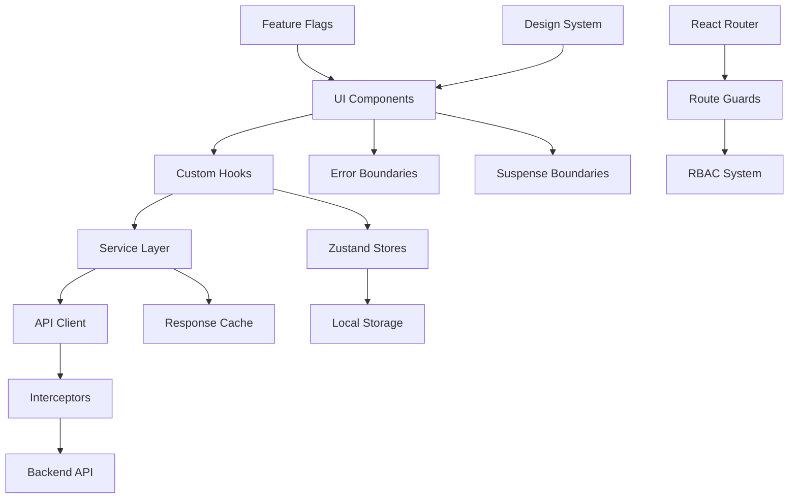
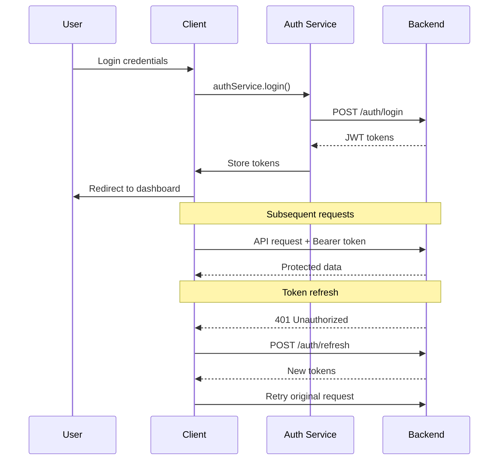
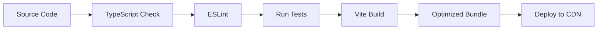

# WellieMD Patient Portal - Architecture Documentation

## Overview

The WellieMD Patient Portal is built as a modern, scalable React application following enterprise-grade architectural patterns. This document outlines the key architectural decisions, patterns, and principles that guide the development of this application.

## Architectural Principles

### 1. Feature-First Organization
- Code is organized by business features rather than technical layers
- Each feature is self-contained with its own components, services, and tests
- Promotes team autonomy and reduces coupling between features

### 2. Separation of Concerns
- Clear boundaries between UI, business logic, and data access
- Components focus on presentation
- Services handle business logic and API communication
- Stores manage application state

### 3. Type Safety
- TypeScript throughout the application
- Runtime validation with Zod at API boundaries
- Strict type checking enabled

### 4. Scalability & Maintainability
- Modular architecture supports team growth
- Clear patterns for adding new features
- Comprehensive testing strategy
- Documentation-driven development

## High-Level Architecture



## Data Flow

### Request Flow
1. **User Interaction** → Component event handler
2. **Component** → Custom hook
3. **Hook** → Service method
4. **Service** → API client
5. **API Client** → Request interceptors
6. **Interceptors** → HTTP request to backend

### Response Flow
1. **Backend Response** → Response interceptors
2. **Interceptors** → Error handling & normalization
3. **Service** → Data transformation
4. **Hook** → Store updates (if needed)
5. **Store/Hook** → Component re-render
6. **Component** → UI update

## Core Architecture Components

### 1. Feature Modules

Each feature is organized as a self-contained module:

```
features/auth/
├── components/        # Feature-specific UI components
├── hooks/            # Feature-specific React hooks
├── services/         # Business logic & API calls
├── store/            # Feature state management
├── types/            # TypeScript definitions
├── pages/            # Route components
├── __tests__/        # Feature tests
└── index.ts          # Public API
```

**Benefits:**
- Clear ownership boundaries
- Easy to add/remove features
- Supports team scaling
- Reduces merge conflicts

### 2. State Management (Zustand)

**Philosophy:** Keep stores small and focused

```typescript
// ✅ Good: Focused store
const useAuthStore = create<AuthState>((set, get) => ({
  user: null,
  isAuthenticated: false,
  login: async (credentials) => { /* ... */ },
}));

// ❌ Avoid: Monolithic store
const useAppStore = create((set, get) => ({
  auth: { /* ... */ },
  patients: { /* ... */ },
  appointments: { /* ... */ },
  // Too much in one store
}));
```

**Store Types:**
- **Feature Stores**: Domain-specific state (auth, patients, etc.)
- **UI Stores**: Global UI state (modals, toasts, sidebar)
- **Cache Stores**: API response caching (if needed)

### 3. API Layer Architecture

**Three-Layer Approach:**

1. **HTTP Client** (`src/shared/api/client.ts`)
   - Axios-based with interceptors
   - Automatic token refresh
   - Request/response normalization
   - Error transformation

2. **Service Layer** (`src/features/*/services/`)
   - Business logic
   - API endpoint abstraction
   - Data transformation
   - Error handling

3. **Hook Layer** (`src/features/*/hooks/`)
   - React integration
   - State management bridge
   - Loading/error states
   - Cache invalidation

**Example Flow:**
```typescript
// Component
const { login, isLoading, error } = useAuth();

// Hook
function useAuth() {
  const store = useAuthStore();
  
  const login = async (credentials) => {
    store.setLoading(true);
    try {
      const result = await authService.login(credentials);
      store.setUser(result.user);
    } catch (error) {
      store.setError(error);
    } finally {
      store.setLoading(false);
    }
  };
  
  return { login, isLoading: store.isLoading, error: store.error };
}

// Service
class AuthService {
  async login(credentials: LoginRequest): Promise<LoginResponse> {
    const response = await apiClient.post('/auth/login', credentials);
    return LoginResponseSchema.parse(response.data);
  }
}
```

### 4. Authentication & Authorization

**Token Management:**
- JWT tokens with automatic refresh
- Secure storage strategy
- Concurrent request handling during refresh
- Automatic logout on token expiry

**RBAC System:**
```typescript
// Permission-based access control
const canViewPatients = usePermission('provider:view:patients');
const hasAdminRole = useRole('admin');
const canAccessRoute = useRouteAccess(['admin'], ['admin:manage:users']);

// Route protection
<RoleGuard requiredRoles={['provider']} requiredPermissions={['provider:view:patients']}>
  <PatientsPage />
</RoleGuard>
```

### 5. Error Handling Strategy

**Multi-Level Error Handling:**

1. **Global Level**: Error boundaries catch unhandled errors
2. **Feature Level**: Feature-specific error handling
3. **Component Level**: Local error states
4. **Service Level**: API error transformation

```typescript
// Error transformation pipeline
API Error → Service Layer → Domain Error → UI Error → User Message
```

**Error Types:**
- `AuthError`: Authentication failures
- `ValidationError`: Input validation errors
- `NetworkError`: Network connectivity issues
- `ServerError`: Backend server errors

### 6. Performance Optimization

**Code Splitting:**
```typescript
// Route-level splitting
const DashboardPage = lazy(() => import('@/features/dashboard/pages/dashboard.page'));

// Component-level splitting
const HeavyChart = lazy(() => import('./heavy-chart.component'));
```

**Bundle Optimization:**
- Feature-based chunks
- Vendor chunk separation
- Dynamic imports for large dependencies
- Tree shaking optimization

**React Optimizations:**
- React.memo for expensive components
- useMemo/useCallback for expensive computations
- Virtualization for large lists
- Suspense for loading states

### 7. Testing Architecture

**Testing Pyramid:**

1. **Unit Tests** (70%)
   - Pure functions
   - Custom hooks
   - Service methods
   - Store logic

2. **Integration Tests** (20%)
   - Component + hooks
   - Service + API
   - Store + service
   - Feature workflows

3. **E2E Tests** (10%)
   - Critical user paths
   - Cross-browser compatibility
   - Performance testing

**Testing Tools:**
- **Vitest**: Test runner
- **React Testing Library**: Component testing
- **MSW**: API mocking
- **Custom utilities**: Test helpers and factories

## Design Patterns

### 1. Service Layer Pattern

**Purpose:** Separate business logic from UI components

```typescript
// Service handles business logic
class PatientService {
  async getPatients(filters: PatientFilters): Promise<Patient[]> {
    const response = await apiClient.get('/patients', { params: filters });
    return response.data.map(this.transformPatient);
  }
  
  private transformPatient(raw: RawPatient): Patient {
    // Business logic for data transformation
    return {
      id: raw.id,
      fullName: `${raw.firstName} ${raw.lastName}`,
      // ... other transformations
    };
  }
}

// Hook provides React integration
function usePatients() {
  const [patients, setPatients] = useState<Patient[]>([]);
  const [isLoading, setIsLoading] = useState(false);
  
  const loadPatients = useCallback(async (filters: PatientFilters) => {
    setIsLoading(true);
    try {
      const result = await patientService.getPatients(filters);
      setPatients(result);
    } finally {
      setIsLoading(false);
    }
  }, []);
  
  return { patients, isLoading, loadPatients };
}
```

### 2. Repository Pattern (for API)

**Purpose:** Abstract data access layer

```typescript
interface PatientRepository {
  findAll(filters: PatientFilters): Promise<Patient[]>;
  findById(id: string): Promise<Patient>;
  create(patient: CreatePatientRequest): Promise<Patient>;
  update(id: string, updates: UpdatePatientRequest): Promise<Patient>;
  delete(id: string): Promise<void>;
}

class ApiPatientRepository implements PatientRepository {
  async findAll(filters: PatientFilters): Promise<Patient[]> {
    const response = await apiClient.get('/patients', { params: filters });
    return response.data.items.map(PatientSchema.parse);
  }
  
  // ... other methods
}
```

### 3. Observer Pattern (for State)

**Purpose:** Reactive state updates

```typescript
// Zustand provides observer pattern out of the box
const useAuthStore = create<AuthState>((set, get) => ({
  user: null,
  // Actions automatically notify subscribers
  setUser: (user) => set({ user }),
}));

// Components automatically re-render when subscribed state changes
function UserProfile() {
  const user = useAuthStore(state => state.user); // Subscribes to user changes
  return <div>{user?.name}</div>;
}
```

### 4. Factory Pattern (for Testing)

**Purpose:** Create test data consistently

```typescript
// Test data factories
export const createMockUser = (overrides: Partial<User> = {}): User => ({
  id: 'test-user-id',
  email: 'test@example.com',
  firstName: 'Test',
  lastName: 'User',
  role: 'patient',
  ...overrides,
});

export const createMockPatient = (overrides: Partial<Patient> = {}): Patient => ({
  id: 'test-patient-id',
  firstName: 'John',
  lastName: 'Doe',
  // ... other defaults
  ...overrides,
});
```

## Security Architecture

### 1. Authentication Flow



### 2. Authorization Layers

1. **Route Level**: Route guards check authentication/permissions
2. **Component Level**: Conditional rendering based on permissions
3. **API Level**: Backend validates all requests
4. **Data Level**: Row-level security where applicable

### 3. Security Best Practices

- **Token Security**: HttpOnly cookies preferred, secure storage fallback
- **CSRF Protection**: CSRF tokens for state-changing operations
- **XSS Prevention**: Content Security Policy, input sanitization
- **Data Validation**: Client and server-side validation
- **Audit Logging**: Track security-relevant actions

## Deployment Architecture

### 1. Build Process



### 2. Environment Strategy

- **Development**: Local development with hot reload
- **Staging**: Pre-production testing environment
- **Production**: Live application with monitoring

### 3. Performance Monitoring

- **Core Web Vitals**: LCP, FID, CLS tracking
- **Bundle Analysis**: Size and dependency tracking
- **Error Monitoring**: Real-time error reporting
- **User Analytics**: Usage patterns and performance

## Scalability Considerations

### 1. Code Organization

- **Feature Modules**: Independent development teams
- **Micro-frontends Ready**: Architecture supports future splitting
- **Dependency Management**: Clear boundaries prevent coupling

### 2. Performance Scaling

- **Code Splitting**: Lazy loading for large applications
- **Caching Strategy**: Intelligent cache invalidation
- **Bundle Optimization**: Tree shaking and dead code elimination

### 3. Team Scaling

- **Clear Patterns**: Consistent code organization
- **Documentation**: Self-documenting architecture
- **Testing Strategy**: Confidence in changes
- **CI/CD Pipeline**: Automated quality gates

## Migration & Evolution

### 1. Technology Upgrades

- **React**: Gradual adoption of new features
- **Dependencies**: Regular updates with automated testing
- **Build Tools**: Vite provides fast iteration

### 2. Architecture Evolution

- **Micro-frontends**: Current architecture supports future splitting
- **State Management**: Zustand allows for gradual migration
- **API Evolution**: Versioning strategy supports changes

### 3. Legacy Integration

- **Incremental Migration**: Feature-by-feature replacement
- **API Compatibility**: Adapter pattern for legacy APIs
- **Data Migration**: Gradual data structure updates

## Conclusion

This architecture provides a solid foundation for building a scalable, maintainable patient portal application. The key benefits include:

- **Developer Experience**: Clear patterns and excellent tooling
- **Maintainability**: Well-organized, testable code
- **Performance**: Optimized bundle and runtime performance
- **Security**: Multi-layered security approach
- **Scalability**: Supports team and application growth

The architecture is designed to evolve with changing requirements while maintaining code quality and developer productivity.
